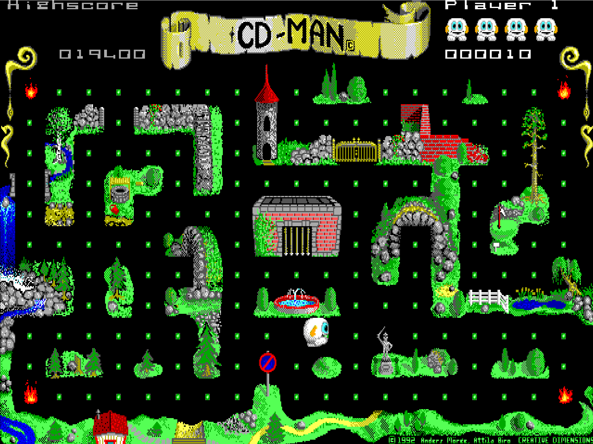
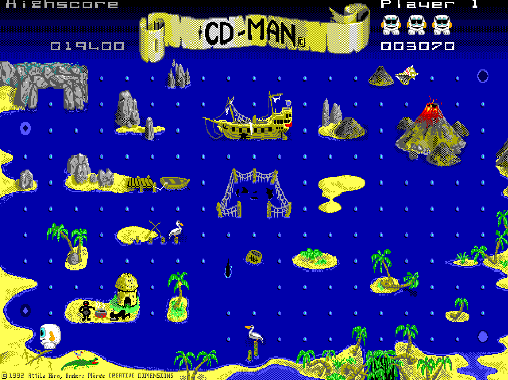

# CD-Man 2

English | [Русский](README.ru.md)

A Go port of **CD-Man 2.0**, the classic maze arcade game by Creative Dimensions (1992), for **Windows, Linux, and macOS**. Collect every dot, avoid enemies, use energy chargers to turn the tables, and explore five worlds with the original graphics and PC-speaker-style sound.

The game runs in a native desktop window. No DOS installation or external DOS emulator is required. All game resources are embedded in the executable.

## Screenshots





## Features

- Five worlds with their original artwork, mazes, enemies, and bonuses.
- **One**, **Two** (alternating turns), and **Double** (simultaneous local play) modes.
- Original menu, selectable speed, built-in demo, help, Top-10 scores, and statistics.
- Keyboard and joystick input.
- Fullscreen at startup; switch to a window with **Alt+Enter**.
- Sharp pixel rendering, a 4:3 display area, and double-buffered rendering on Windows.
- Direct game start without the original identification prompt.
- Persistent high scores and demo data in the user's configuration folder.

## Requirements

| Platform | Build requirements | Runtime requirements |
| --- | --- | --- |
| Windows x64 / ARM64 | Go 1.22+; internet access for the icon tool on its first use | Windows system libraries; no SDL2 or C compiler |
| Linux | Go 1.22+, a C compiler, cgo enabled | SDL2 runtime and a graphical desktop session |
| macOS Intel / Apple Silicon | Go 1.22+, Xcode Command Line Tools, cgo enabled | SDL2 runtime |

Linux and macOS load SDL2 dynamically: SDL2 development headers are not required, and SDL3 cannot replace SDL2. On macOS, the loader also checks `/opt/homebrew/lib`, `/usr/local/lib`, and `/Library/Frameworks/SDL2.framework/SDL2`.

Go is needed only to build the game, not to play a compiled release. Build Linux and macOS on the target operating system with the required compiler and SDL2 installed.

## Build and run

Clone the repository or extract the source archive. Run build commands from the project root, where `main.go`, `go.mod`, and `cdman2.ico` are located:

```sh
git clone https://github.com/afsutulov/CD-Man2.git
cd CD-Man2
```

### Windows: build with the game icon

The root-level `cdman2.ico` contains transparent images at 16, 24, 32, 48, 64, 128, and 256 pixels. Go does not automatically embed an ICO: generate a Windows resource object first, then build the **package**.

Run in **PowerShell** on Windows:

```powershell
$arch = go env GOARCH
$env:CGO_ENABLED = "0"
go run github.com/akavel/rsrc@v0.10.2 -arch $arch -ico cdman2.ico -o "rsrc_windows_$arch.syso"
go build -trimpath -ldflags="-s -w -H=windowsgui" -o CD-Man2.exe .
.\CD-Man2.exe
```

The versioned resource tool runs separately without adding a dependency to `go.mod`. Its `.syso` output must be beside `main.go`. Go automatically links the resource matching the target platform and architecture. Build **`.`**, not `main.go`, so the resource is included. `-H=windowsgui` prevents a separate console window from appearing.

For Windows ARM64 cross-compilation from x64 Windows, generate the resource **before** changing the build target:

```powershell
go run github.com/akavel/rsrc@v0.10.2 -arch arm64 -ico cdman2.ico -o rsrc_windows_arm64.syso
$env:GOARCH = "arm64"
go build -trimpath -ldflags="-s -w -H=windowsgui" -o CD-Man2-arm64.exe .
Remove-Item Env:GOARCH
```

To cross-compile Windows from Linux or macOS, run the generator on the host first, then set the target only for the build command:

```sh
go run github.com/akavel/rsrc@v0.10.2 -arch amd64 -ico cdman2.ico -o rsrc_windows_amd64.syso
GOOS=windows GOARCH=amd64 CGO_ENABLED=0 go build -trimpath -ldflags="-s -w -H=windowsgui" -o CD-Man2.exe .
```

A generated `.syso` is a build artifact. Keep it for later builds, or delete it after compilation and regenerate it next time. Regenerate it after changing `cdman2.ico`. The platform and architecture suffixes prevent these resources from being linked into Linux/macOS builds or builds for another CPU architecture.

The embedded icon appears for the Windows executable in Explorer and shortcuts. Linux and macOS do not use Windows ICO resources as executable icons; desktop integration there requires a platform-specific launcher or application bundle.

### Linux

Install Go, a C compiler, and the SDL2 runtime using the tools appropriate to your distribution, then run:

```sh
CGO_ENABLED=1 go build -trimpath -ldflags="-s -w" -o CD-Man2 .
./CD-Man2
```

### macOS

Install Go, SDL2, and Xcode Command Line Tools. If compiler tools are missing, run `xcode-select --install`. With Homebrew, install SDL2 using `brew install sdl2`.

```sh
CGO_ENABLED=1 go build -trimpath -ldflags="-s -w" -o CD-Man2 .
./CD-Man2
```

This produces a native executable for the installed Go toolchain's architecture, rather than a macOS `.app` bundle.

## Controls and menus

| Action | Control |
| --- | --- |
| Open the menu from the title sequence | Space |
| Navigate menu columns and items | Arrow keys |
| Select the highlighted item | Enter |
| Move with keyboard control in One / Two mode | Arrow keys |
| Move player 1 in Double mode | W up, A left, D right, Z or X down |
| Move player 2 in Double mode | Arrow keys |
| Return to the menu during play | Esc |
| Resume the current game | GAME → Continue |
| Toggle fullscreen / windowed display | Alt+Enter |
| Switch between Top-10 and statistics | Space on the Top-10 / statistics page |
| Exit through the menu | GAME → Quit |
| Exit immediately, potentially losing unsaved scores | Ctrl+Q |

Choose player mode under **PLAYER**, speed under **SPEED**, and sound under **SOUND**. **GAME → Control** switches keyboard or joystick control; the platform adapter reads the first available joystick. **SEE → Info** opens the original English help, **SEE → Demo** starts the demo, and **SEE → Position** shows the current game position.

To save high scores, exit with **GAME → Quit**. Esc preserves the current game only while the application remains open.

## Saved data

The application uses `os.UserConfigDir()` and stores `HIGHSC.CDM` and `DEMO.CDM` in a `CDMan-Go` subfolder:

| Platform | Default folder |
| --- | --- |
| Windows | `%APPDATA%\CDMan-Go` |
| Linux | `$XDG_CONFIG_HOME/CDMan-Go`, or `~/.config/CDMan-Go` |
| macOS | `~/Library/Application Support/CDMan-Go` |

Existing files override the embedded copies. Replacing the executable does not remove saved data. The save folder must be writable.

Closing the window does not save a gameplay checkpoint: **Continue** resumes within the current session, not after restarting the application.

## Source layout and checks

| Path | Purpose |
| --- | --- |
| `main.go` | Application entry point and persistent storage |
| `internal/game/` | Translated game logic, state, graphics, sound, and tests |
| `internal/assets/` | Embedded initial state and original `.CDM` resources |
| `internal/platform/` | Windows Win32/GDI/WinMM adapter; Linux/macOS SDL2/cgo adapter |
| `cdman2.ico` | Windows application icon |
| `LICENSE-font.txt` | Bundled bitmap font license |

Run the existing checks from the project root:

```sh
go test ./...
```

Tests cover byte arithmetic, exact pixel hashes of all 17 graphical resources, and the menu → start → movement → pause → continue workflow. Native windows, audio, and input also need testing on each supported operating system.

## Credits and licensing

Original game: **Creative Dimensions**, Anders Moree and Attila Biro, 1992. Original artwork and game content retain the rights of their respective copyright holders.

The bundled 8×14 bitmap font (`internal/game/ega14.bin`) comes from the DOSBox-X `int10_font_14` table, copyright © 2002–2020 The DOSBox Team, licensed under GPL-2.0-or-later. See [LICENSE-font.txt](LICENSE-font.txt). This license does not grant a license to other game content.

Windows icon resource generation uses [rsrc](https://github.com/akavel/rsrc), a separate build-time tool licensed under MIT.
